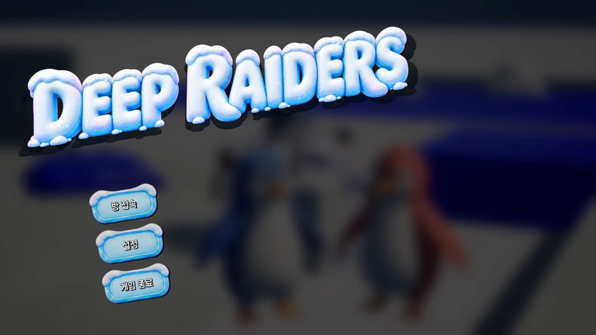
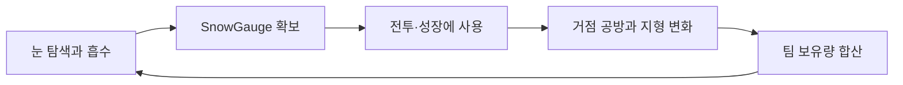
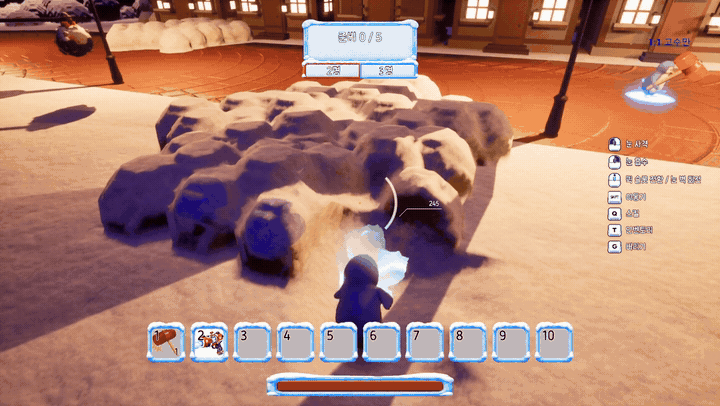
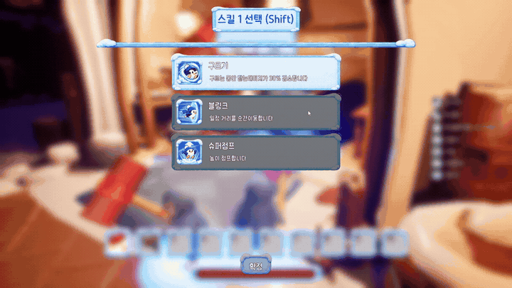
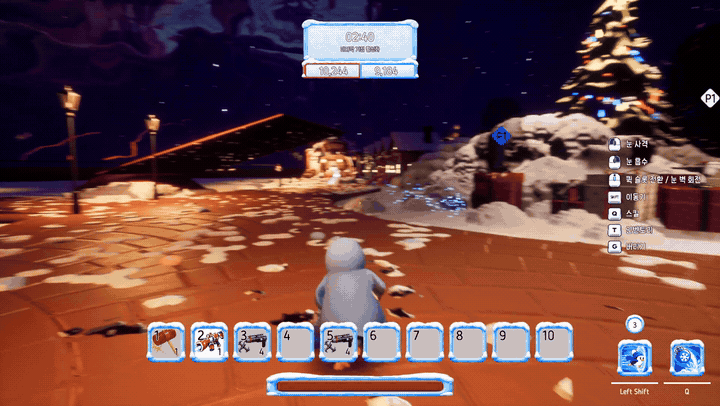
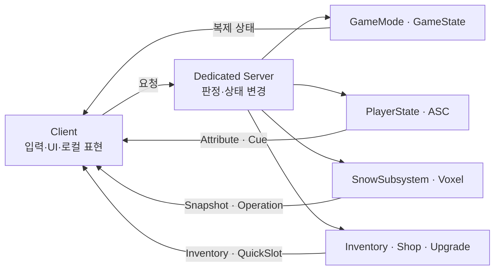

# Deep Raiders

> 눈을 모아 싸우고, 성장시키고, 끝까지 남겨 승리하는 3:3 팀 기반 액션 슈팅 게임

<p align="center">
  
</p>

Deep Raiders는 Unreal Engine 5.7로 제작한 6인 팀 프로젝트입니다. 플레이어는 실시간 Voxel 전장에서
눈을 흡수해 `SnowGauge`를 확보하고, 같은 자원을 무기·스킬·성장과 최종 점수 사이에서 전략적으로
배분합니다. 지형을 직접 쌓고 깎을 수 있어 전투 중 엄폐물과 이동 경로도 계속 변화합니다.

| 항목 | 내용 |
|---|---|
| 장르 | 3:3 팀 기반 3인칭 액션 슈팅 |
| 개발 기간 | 2026.08.05–2026.09.13 |
| 개발 인원 | 6명 |
| 엔진 | Unreal Engine 5.7 |
| 네트워크 | Dedicated Server · 서버 권한 판정 |
| 주요 기술 | GAS · Voxel Terrain · MVVM · Niagara |

## 핵심 게임 루프



눈은 하나의 수치지만 세 가지 선택지를 만듭니다.

- **전투 자원**: 무기 발사와 스킬 사용에 소비하고, 지형에 적중하면 눈 지형을 변화시킵니다.
- **성장 재화**: 상점에서 아이템·스킬·퍽을 구매하거나 무기와 캐릭터를 강화합니다.
- **승리 자원**: 경기 종료 시 팀원이 보유한 눈을 합산해 결과에 반영합니다.

즉시 소비하면 전투에서 유리하지만, 많이 남길수록 승리에 가까워지는 구조가 핵심 전략입니다.

## 플레이 화면

<p align="center">
  
  <br>
  <sub>눈 흡수 · SnowGauge 획득 · 실시간 Voxel 지형 변화</sub>
</p>

<table>
  <tr>
    <td align="center" width="50%">
      <br>
      <sub>데이터 기반 스킬 선택</sub>
    </td>
    <td align="center" width="50%">
      <br>
      <sub>원거리 무기와 GameplayCue 전투 피드백</sub>
    </td>
  </tr>
</table>

## 주요 기능

### 실시간 눈 지형

- `UDRSnowSubsystem`을 외부 진입점으로 두고 눈 추가·제거 작업의 실행 순서를 관리합니다.
- 서버가 실제 Voxel 변화량인 `AppliedAmount`를 계산하고, 자원·게이지·복제 작업의 공통 기준으로 사용합니다.
- 클라이언트는 서버가 확정한 작업만 순서대로 재생해 지형 외형과 게임 상태의 정합성을 유지합니다.
- 중도 난입 시 Snapshot을 복원한 뒤 전송 중 누적된 Operation을 재생합니다.

### GAS 기반 전투와 스킬

- `Ability`, `GameplayEffect`, `GameplayTag`, `GameplayCue`를 조합해 공격·빙결·이동·보호막 스킬을 구성합니다.
- `ASC`와 `AttributeSet`은 `PlayerState`가 소유해 사망과 리스폰 뒤에도 플레이 상태를 유지합니다.
- 원거리 무기는 공통 공격 정책과 Projectile/HitScan 판정을 분리해 새로운 무기 유형을 확장할 수 있습니다.
- 피해·자원 소모·Cooldown은 서버가 확정하고, 클라이언트는 입력 요청과 즉각적인 표현을 담당합니다.

### 데이터 기반 아이템과 성장

- `ItemDefinition`의 정적 설정과 GUID를 가진 `ItemInstance`의 런타임 상태를 분리합니다.
- 인벤토리·퀵슬롯·월드 드롭이 동일한 Instance를 사용해 탄약과 강화 상태를 보존합니다.
- 상점 거래와 강화 요청은 서버가 가격·재화·보유 공간을 검증한 뒤 반영합니다.
- Skill/Perk Definition과 공용 Effect 조합으로 콘텐츠 추가 시 조건문 증가를 줄였습니다.

### 상호작용과 피드백

- 로컬 클라이언트가 거리·조준각·Line of Sight를 평가해 빠르게 상호작용 대상을 표시합니다.
- 실제 상호작용은 서버가 같은 공간 조건과 소유권을 다시 검증한 뒤 실행합니다.
- VFX Library가 GameplayTag를 Niagara 설정에 매핑해 호출부와 연출 자산의 의존을 분리합니다.
- 지속 VFX는 Target과 Tag를 기준으로 관리해 중복 Effect, 리스폰, Late Join 상황을 처리합니다.

### 멀티플레이와 경기 운영

- `GameMode`가 경기 페이즈·팀·승패를 결정하고 `GameState`가 복제 상태를 전달합니다.
- RoomService가 방 조회·생성·입장과 Dedicated Server 프로세스 흐름을 지원합니다.
- 대규모 동적 월드는 압축 Snapshot, Chunk 전송, ACK Window와 후속 Operation으로 동기화합니다.
- UI는 Manager, Widget, ViewModel을 분리해 복제된 게임 상태와 로컬 표현을 연결합니다.

## 기술 구조



게임플레이 코드는 `DeepRaiders` Runtime 모듈에, 데이터 가져오기 등 Editor 전용 기능은
`DeepRaidersEditor` 모듈에 분리되어 있습니다.

## 프로젝트 구조

```text
DeepRaiders/
├─ Config/                       # 게임·네트워크·입력 설정
├─ Content/DeepRaiders/          # 맵, Blueprint, UI와 게임 에셋
├─ Plugins/
│  ├─ RoomService/               # 방 및 Dedicated Server 운영
│  └─ VoxelPluginFreeLegacy/     # Voxel 지형 기반
└─ Source/
   ├─ DeepRaiders/               # Runtime 게임플레이 모듈
   │  ├─ Core, Player, GAS
   │  ├─ Snow, Combat, Skill
   │  ├─ Item, Inventory, Shop, Upgrade
   │  └─ UI, VFX
   └─ DeepRaidersEditor/         # Editor 전용 도구
```

## 팀 구성

| 팀원 | 중점 기여 영역 |
|---|---|
| 신다인 (`Shin Dain`) | 아이템·인벤토리·상호작용, 원거리 무기 기반, GameplayCue·VFX |
| 이승민 (`SeungMinLee`) | PlayerState GAS, 애니메이션·짚라인, 빙결 표현, 원거리 무기 확장 |
| 이재묵 (`dotori`) | 상점·거래, 스킬·퍽, 캐릭터·무기 강화와 UI |
| 김진강 (`kimjinkang`) | 눈 흡수 정확도, 매몰 대응, 보호막·카메라·전투 피드백 |
| 오동훈 (`netter36`) | 눈 시스템 코어, Snapshot·중도 난입, 패킷·연산 최적화 |
| 신희성 (`shees95`) | 경기 페이즈, UI/MVVM, Sound Manager, RoomService와 맵 구성 |

> 기여 영역은 Git 이력과 현재 코드에서 확인한 중점 분야이며, 각 기능의 독점 소유를 의미하지 않습니다.

## 실행 환경

1. Unreal Engine **5.7**과 Windows C++ 빌드 환경을 준비합니다.
2. `DeepRaiders.uproject`의 Visual Studio 프로젝트 파일을 생성합니다.
3. `DeepRaidersEditor`를 `Development Editor | Win64`로 빌드합니다.
4. `DeepRaiders.uproject`를 열어 프로젝트를 실행합니다.

Game, Editor, Dedicated Server Target을 제공합니다. 방 생성과 실제 멀티플레이 실행에는 RoomService 및
Dedicated Server 환경 설정이 추가로 필요합니다.

## 참고 문서

- [RoomService UI 연동](Docs/RoomServiceUI.md)
- [방 목록 갱신 흐름](Docs/RoomListUpdates.md)

## 확인 범위

이 README는 발표 자료, Git 이력, C++ 소스와 프로젝트 설정을 대조해 작성했습니다. Blueprint, Map,
DataAsset의 최종 연결과 실제 네트워크 동작은 Unreal Editor, PIE 또는 Dedicated Server 실행으로 별도
검증해야 합니다.
